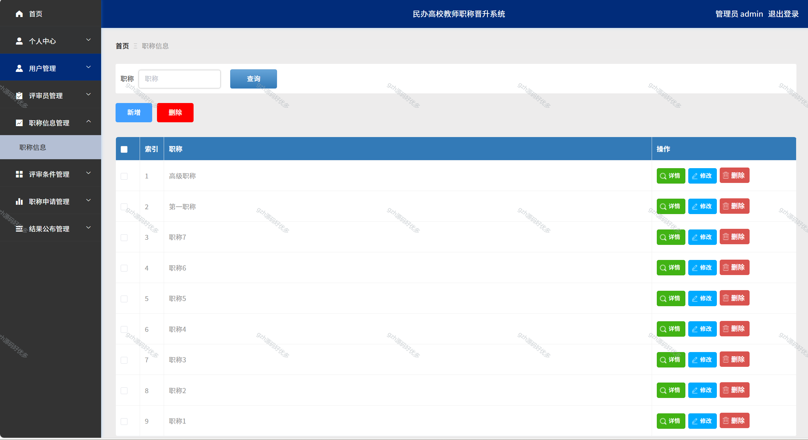

# python102
python102基于Python+Flask的民办高校教师职称晋升系统
 
## 查看主页获取源码

### 一、关键词
民办高校教师职称晋升体系，民办高校教师职称评定机制，民办高校教师职称晋级制度

### 二、作品包含
源码+数据库+全套环境和工具资源+本地部署教程

### 三、项目技术
前端技术：Vue2.0、Element-ui
后端技术：Python3.7、Flask

### 四、运行环境（以下版本亲测，其他版本兼容性请自行测试）
开发工具：PyCharm + VSCODE

数据库：MySQL5.7（最低要5.7版本）

数据库管理工具：Navicat10+

Python：Python3.7

前端Nodejs：14

浏览器：谷歌浏览器

### 五、项目介绍
项目编号：python0102

民办高校教师职称晋升系统是教师职业发展的重要阶梯，能规范晋升流程，确保评审公平公正。它为教师提供明确的成长目标，激励其提升教学、科研能力，同时帮助学校筛选优秀师资，优化师资结构，助力学校教育质量提升。
管理员可在个人中心修改密码与信息 ；能管理用户、评审员，维护职称、评审条件等信息；处理教师职称申请，审核后还可公布结果 。

### 六、运行截图

